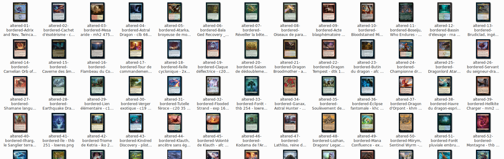
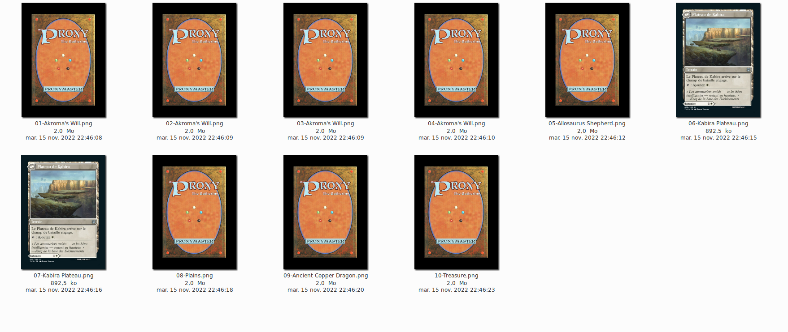

# mtgprint

Prepare a list of card to be printed as proxies on custom playing cards.

## Fonctionalities
Parse decklist in arena format

For each card, automaticaly fetch the best option between hundreds of prints, based on language, image resolution or per-image preference.

For each card, automaticaly fetch associated tokens.

Prepare each fetched image for print on MPC, correct some imperfections, adding appropriate border and covering trademark with a stamp.

## Usage

1. Clone this repo and setup python env.

```bash
git clone https://github.com/zerrac/mtgprint.git
cd mtgprint
virtualenv python-env
source python-env/bin/activate
pip install -r requirements.txt
```

2. Prepare your decklist

A decklist consist in a text file containing the cards you want to print.

Example :
```
4 Akroma's Will
1 Allosaurus Shepherd
2 Kabira Takedown // Kabira Plateau
1 Plains (neo) 293
1 Ancient Copper Dragon
```

You can specify a set and a collector name for a card (or for every card if you with) but note that it may reduce the chance to find an image in preferred language


3. Run the script

```bash
python3 mtgprint.py --help
usage: mtgprint.py [-h] [--decklist DECKLIST] [--deckname DECKNAME] [--language PREFERRED_LANG] [--notforsale NOTFORSALE]

Prepare decks for printing as proxies.

optional arguments:
  -h, --help            show this help message and exit
  --decklist DECKLIST   load deck list from a file (default : decklist.txt)
  --deckname DECKNAME   Name of the deck aka name of the folder where the deck will be printed. (default: decklist file name without extension
  --language PREFERRED_LANG, -l PREFERRED_LANG
                        Card prints localized in specified language will be prioritized. Please use ISO code. (default : fr)
  --notforsale NOTFORSALE
                        Path to the image to put over the trademark
```

Example :

```bash
_$ python3 mtgprint.py --decklist ./my_decklist.txt --language fr
Loading deck list...
Fetchings source images...
Preparing for impression...
Deck 'my_decklist' is ready for printing !
CARDS :
4 Akroma's Will
1 Allosaurus Shepherd
2 Kabira Takedown // Kabira Plateau
1 Plains
1 Ancient Copper Dragon
TOKENS :
1 Treasure (oracle_id: 3c549374-6c37-42e0-8d88-a8555d46732d)

_$ tree output/my_decklist/
output/my_decklist/
├── back
│   ├── 01-Akroma's Will.png
│   ├── 02-Akroma's Will.png
│   ├── 03-Akroma's Will.png
│   ├── 04-Akroma's Will.png
│   ├── 05-Allosaurus Shepherd.png
│   ├── 06-Kabira Plateau.png
│   ├── 07-Kabira Plateau.png
│   ├── 08-Plains.png
│   ├── 09-Ancient Copper Dragon.png
│   └── 10-Treasure.png
└── front
    ├── 01-Akroma's Will.png
    ├── 02-Akroma's Will.png
    ├── 03-Akroma's Will.png
    ├── 04-Akroma's Will.png
    ├── 05-Allosaurus Shepherd.png
    ├── 06-Kabira Takedown.png
    ├── 07-Kabira Takedown.png
    ├── 08-Plains.png
    ├── 09-Ancient Copper Dragon.png
    └── 10-Treasure - 3c549374-6c37-42e0-8d88-a8555d46732d.png

2 directories, 20 files
```

Here is the result : 

## Additional tools
You shouldn't have to use those tools as the main script takes care of everithing for you. 

### Cover trademarks
This tool tries his best to automaticaly detect trademark position and cover it with a patch of appropriate color and the "not for sale" mention.

```bash
_$ python3 -m tools.cover_trademarks <path to deck image folder>
```

### Randomize images
If you upload two times the same pictures on MPC (even with different names) they will be deduplicate and MPC will store only one image. This is problematic because it prefent us to use the "[Help me autofill images!]" functionality.

This tool set the four corner pixels to random colors, making the image relatively unique. The colored pixel wont show on the final printed card because they are located in the bleeding area.

This way, you can upload the whole directory, same cards wont be deduplicated by MPC and as front and back are numeroted in the same order, they should match in final printing.
```bash
_$ python3 tools.randomize_images <path to deck image folder>
```

### Set DPI
Images downloaded are usually in 72DPI. The tools just change DPI to 300 for every file in a given folder

```bash
_$ python3 tools.set_dpi <path to deck image folder>
```