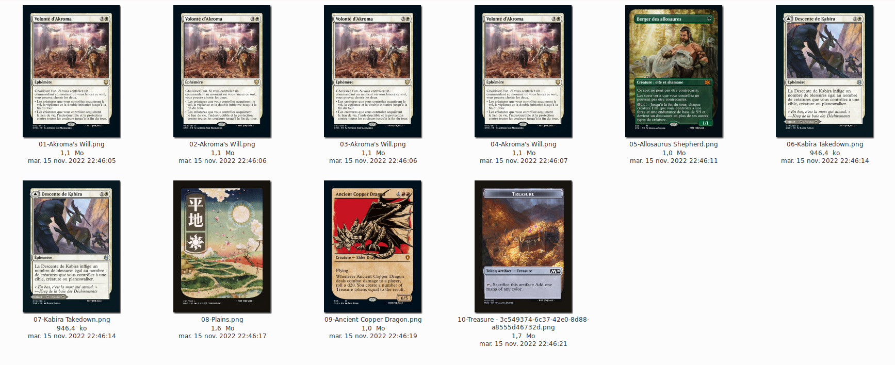

# mtgprint

Prepare a list of card to be printed as proxies on custom playing cards.

Automaticaly select the best option between hundreds of prints available on [Scryfall](https://scryfall.com/), based on image resolution and language.

Automaticaly cover imperfections on png from scryfall using adapted beziers curves and add a border of appropriate color.

## Usage

1. Clone this repo.

```bash
git clone https://github.com/zerrac/mtgprint.git
cd mtgprint
```

2. Prepare your decklist

You can use decklist.txt at the root of the repo as an example.

Syntax is basic, each line is composed of `<quantity> <card name>` where :
- `<quantity>` is the number of copies of a card you want to print.
- `<card name>` is the exact english card name to search for, case insenstive. 

The validation is very naive : Everything before the first space is considered as `<quantity>` and everything else is considered as `<card name>`.
No empty lines allowed. 

Example :
```
4 Akroma's Will
1 Allosaurus Shepherd
3 Forest
```

3. Run the script

```bash
python3 mtgprint.py --help
usage: mtgprint.py [-h] [--decklist DECKLIST] [--language PREFERRED_LANG]

Prepare decks for printing as proxies.

optional arguments:
  -h, --help            show this help message and exit
  --decklist DECKLIST   load deck list from a file (default : decklist.txt)
  --language PREFERRED_LANG, -l PREFERRED_LANG
                        Card prints localized in specified language will be prioritized. Please use ISO code. (default : fr)
```

Exemple :

```bash
_$ python3 mtgprint.py --decklist ./my_decklist.txt --language fr
Loading deck list...
Selected print for Akroma's Will has a score of 21 (localized in 'fr' and with image quality 'lowres')
Selected print for Allosaurus Shepherd has a score of 21 (localized in 'fr' and with image quality 'lowres')
Selected print for Forest has a score of 22 (localized in 'fr' and with image quality 'highres_scan')
Fetchings source images...
Preparing for impression...
```
Images are prioritized according to the following order:
  - card localized in preferred language + high res
  - card localized in preferred language + low res
  - card localized in english + high res
  - card localized in english + low res

If several images obtain the same score, the one with the highest USD price will be selected (because why not).


Here is the result : 


## Acknowledgements

- [Scryfall](https://scryfall.com/), [Scryfall API](https://scryfall.com/docs/api).
